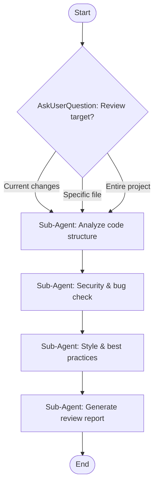

## Workflow Execution Guide

Follow the Mermaid flowchart above to execute the workflow. Each node type has specific execution methods as described below.

### Execution Methods by Node Type

- **Rectangle nodes (Sub-Agent: ...)**: Execute Sub-Agents
- **Diamond nodes (AskUserQuestion:...)**: Use the AskUserQuestion tool to prompt the user and branch based on their response
- **Diamond nodes (Branch/Switch:...)**: Automatically branch based on the results of previous processing (see details section)
- **Rectangle nodes (Prompt nodes)**: Execute the prompts described in the details section below

---

## Node Details

### review_target (AskUserQuestion)
Question: "What would you like to review?"
Options:
1. **Current unstaged changes** - Review modified files in working directory
2. **Specific file** - Review a single file you specify
3. **Recent commit** - Review the latest commit
4. **Entire project** - Full codebase review

### step1: Analyze code structure
**Task**: Explore the code to understand its purpose and structure
- Identify main functions, classes, and components
- Map data flow and dependencies
- Note architectural patterns used

### step2: Security & bug check
**Task**: Check for security issues and potential bugs
- Look for OWASP vulnerabilities (XSS, injection, etc.)
- Check for null/undefined handling
- Verify error handling exists
- Look for race conditions or state issues

### step3: Style & best practices
**Task**: Review code style and best practices
- Check naming conventions
- Verify DRY principles
- Check for code duplication
- Review function complexity
- Assess test coverage

### step4: Generate review report
**Task**: Compile findings into a structured report
- Summary of changes/files reviewed
- Critical issues (security, bugs)
- Suggestions for improvement
- Style recommendations
