```mermaid
flowchart TD
    start_node_default([Start])
 %% 开始和任务接收
    Start([开始工作流]) --> ReceiveTask[接收任务<br/>询问用户具体需求]
    ReceiveTask --> TaskClear{任务是否清晰?}
    TaskClear -->|否| ClarifyAsk[详细询问需求<br/>向用户询问更多细节]
    ClarifyAsk --> ReceiveTask
    TaskClear -->|是| CheckBackup[检查备份文件<br/>查找并清理 copy/副本/backup]

    %% 备份检查和代码理解
    CheckBackup --> BackupExist{存在备份文件?}
    BackupExist -->|有| CleanBackup[删除备份文件<br/>删除所有备份、副本文件]
    CleanBackup --> CodeUnderstand[理解现有代码结构<br/>分析项目结构和现有代码]
    BackupExist -->|无| CodeUnderstand
    CodeUnderstand --> DoCode[代码修改<br/>按照需求修改代码]

    %% 测试阶段
    DoCode --> TestPhase[测试阶段<br/>启动开发环境进行测试]
    TestPhase --> RunDev[启动开发环境<br/>npm start 同时启动前后端]
    RunDev --> BackendStart{后端启动成功?}
    BackendStart -->|失败| FixBackend[解决后端问题<br/>检查端口占用、CORS配置]
    FixBackend --> BackendStart
    BackendStart -->|成功| FrontendStart[启动前端<br/>确保前端正常启动]
    FrontendStart --> RunTest[运行自动化测试<br/>执行 npm test 运行单元测试]

    %% 单元测试结果
    RunTest --> TestPass{测试通过?}
    TestPass -->|否| FixTest[修复测试问题<br/>修复失败的测试用例]
    FixTest --> RunTest
    TestPass -->|是| E2ETest[E2E 测试阶段<br/>执行端到端测试]

    %% E2E 测试 - 数据库测试
    E2ETest --> DBTest[数据库测试<br/>运行 test_ranking_db.js]
    DBTest --> DBResult{数据库测试通过?}
    DBResult -->|否| FixDB[修复数据库问题<br/>修复 Supabase/RLS 策略]
    FixDB --> DBTest
    DBResult -->|是| PlaywrightTest[Playwright 测试<br/>运行 test_ranking_playwright.js]

    %% Playwright 测试结果
    PlaywrightTest --> PlaywrightResult{Playwright 通过?}
    PlaywrightResult -->|否| FixE2E[修复 E2E 问题<br/>修复 Playwright 测试问题]
    FixE2E --> PlaywrightTest
    PlaywrightResult -->|是| CodeReview[代码审查<br/>进行安全和代码质量检查]

    %% 代码审查阶段
    CodeReview --> ReviewSecurity{安全检查通过?}
    ReviewSecurity -->|需要| FixSecurity[修复安全问题<br/>移除敏感信息/修复 CORS]
    FixSecurity --> ReviewSecurity
    ReviewSecurity -->|通过| ReviewQuality{代码质量通过?}
    ReviewQuality -->|需要| FixQuality[修复代码质量问题<br/>修复 ESLint 错误]
    FixQuality --> ReviewQuality
    ReviewQuality -->|通过| UpdateDocs[更新文档<br/>更新 README、CHANGELOG]

    %% 提交阶段
    UpdateDocs --> CommitPhase[提交代码<br/>使用约定式提交规范]
    CommitPhase --> CommitMsg[编写提交信息<br/>编写符合规范的 commit message]
    CommitMsg --> GitAdd[git add 文件<br/>添加修改的文件到暂存区]
    GitAdd --> GitCommit[git commit<br/>提交代码到本地仓库]
    GitCommit --> PushRemote[推送到远程<br/>git push 到远程仓库]

    %% 部署阶段
    PushRemote --> DeployPhase[部署阶段<br/>部署到 CloudBase 生产环境]
    DeployPhase --> Build[构建生产版本<br/>npm run build 构建前端]
    Build --> DeployFrontend[部署前端<br/>使用 cloudbase hosting:deploy]
    DeployFrontend --> DeployBackend[部署后端<br/>使用 tcb cloudrun deploy]
    DeployBackend --> DeployDocs[部署文档<br/>部署文档到静态托管]
    DeployDocs --> End([工作流完成])

    %% 样式定义
    classDef startEnd fill:#10b981,stroke:#059669,stroke-width:2px,color:#fff
    classDef task fill:#3b82f6,stroke:#2563eb,stroke-width:2px,color:#fff
    classDef decision fill:#f59e0b,stroke:#d97706,stroke-width:2px,color:#fff
    classDef fix fill:#ef4444,stroke:#dc2626,stroke-width:2px,color:#fff

    class Start,End startEnd
    class ReceiveTask,CheckBackup,CodeUnderstand,DoCode,TestPhase,RunDev,FrontendStart,RunTest,E2ETest,DBTest,PlaywrightTest,CodeReview,UpdateDocs,CommitPhase,CommitMsg,GitAdd,GitCommit,PushRemote,DeployPhase,Build,DeployFrontend,DeployBackend,DeployDocs task
    class TaskClear,BackupExist,BackendStart,TestPass,DBResult,PlaywrightResult,ReviewSecurity,ReviewQuality decision
    class ClarifyAsk,CleanBackup,FixBackend,FixTest,FixDB,FixE2E,FixSecurity,FixQuality fix

    end_node_default([End])

```

## Workflow Execution Guide

Follow the Mermaid flowchart above to execute the workflow. Each node type has specific execution methods as described below.

### Execution Methods by Node Type

- **Rectangle nodes (Sub-Agent: ...)**: Execute Sub-Agents
- **Diamond nodes (AskUserQuestion:...)**: Use the AskUserQuestion tool to prompt the user and branch based on their response
- **Diamond nodes (Branch/Switch:...)**: Automatically branch based on the results of previous processing (see details section)
- **Rectangle nodes (Prompt nodes)**: Execute the prompts described in the details section below


## 工作流程执行指南

### 节点执行方法

| 节点类型 | 说明 | 执行方式 |
|---------|------|---------|
| 圆角矩形 (开始/结束) | 工作流起点/终点 | 自动执行 |
| 矩形 (任务) | 具体执行任务 | 直接执行描述的操作 |
| 菱形 (判断) | 条件分支判断 | 使用 AskUserQuestion 工具确认或自动检测 |
| 红色矩形 (修复) | 问题修复任务 | 执行修复操作后返回判断节点 |

---

### 阶段 1: 接收任务

**触发**: 用户运行 `/my-workflow` 命令

1. 询问用户具体需求
2. 明确任务目标和范围
3. 确认是否有特殊要求

---

### 阶段 2: 文件整理检查

**自动执行**:

```powershell
# 查找备份文件
Get-ChildItem -Recurse -Filter "*copy*" | Select-Object FullName
Get-ChildItem -Recurse -Filter "*副本*" | Select-Object FullName
Get-ChildItem -Recurse -Filter "*_backup*" | Select-Object FullName
```

**检查规则**:

| 模式 | 说明 | 行动 |
|------|------|------|
| `*copy*` | 调试/备份文件 | 删除 |
| `*副本*` | 中文备份文件夹 | 删除 |
| `*_backup*` | 带 backup 后缀 | 删除 |

---

### 阶段 3: 代码修改

**流程**:
1. 理解现有代码结构
2. 按需修改代码
3. 遵循项目文件组织规范

**文件命名规范**:
- 组件: `PascalCase.jsx`
- Hooks: `camelCase.js`
- 工具: `camelCase.js`
- 样式: 与组件同名 `.css`

---

### 阶段 4: 测试

**启动命令**:

```bash
# 后端 (允许跨域)
ALLOWED_ORIGIN="*" npm run server

# 前端
npm run dev

# 同时启动
npm start
```

**常见问题解决**:

| 问题 | 解决方案 |
|------|---------|
| 端口占用 | `netstat -ano \| findstr <端口>` 然后 `taskkill //F //PID <PID>` |
| CORS 错误 | 设置环境变量 `ALLOWED_ORIGIN="*"` |
| 连接云端 | 使用 `.env.development` 配置本地服务器 |

---

### 阶段 4.1: E2E 测试 (排名系统)

**数据库测试**:

```bash
# 运行数据库测试
node test_ranking_db.js
```

**Playwright E2E 测试**:

```bash
# 确保前后端已启动，然后运行
npx playwright install chromium  # 首次安装
node test_ranking_playwright.js
```

**测试内容**:
- 首页加载和排名按钮显示
- 打开排名模态框
- 排行榜数据加载
- 战绩面板切换
- 段位显示
- 统计数据展示
- 模态框关闭
- 首页段位图标

---

### 阶段 4.2: 测试问题修复

**常见测试问题及解决方案**:

| 问题 | 错误信息 | 解决方案 |
|------|---------|---------|
| Supabase 406 错误 | HTTP 406 (Not Acceptable) | 将 `.single()` 改为 `.maybeSingle()` |
| RLS 阻止插入 | Row level security error | 创建 RLS 策略或禁用 RLS |
| Playwright 超时 | Timeout exceeded | 增加 waitForSelector 超时时间 |
| 端口占用 | Port already in use | `taskkill //F //PID <PID>` |

**Supabase 406 错误修复**:

```javascript
// 错误写法 (src/lib/supabase.js)
const { data, error } = await supabase
  .from('player_stats')
  .select('*')
  .eq('user_id', userId)
  .single()  // 无结果时返回 406

// 正确写法
const { data, error } = await supabase
  .from('player_stats')
  .select('*')
  .eq('user_id', userId)
  .maybeSingle()  // 无结果时返回 null
```

---

### 阶段 5: 代码审查

**安全检查项**:
- [ ] 移除 Git 历史中的敏感文件 (`.env`)
- [ ] CORS 配置正确 (生产环境不使用 `*`)
- [ ] 无硬编码的环境 ID
- [ ] 环境变量使用 `process.env`

**代码质量检查**:
- [ ] 修复闭包问题 (使用 useRef)
- [ ] 清理重复/备份文件
- [ ] ESLint 检查通过

---

### 阶段 6: 提交代码

**提交规范**:

```bash
# 添加文件
git add <文件列表>

# 提交 (使用约定式提交)
git commit -m "type: description

## 更新内容
- 变更1
- 变更2

## 修改的文件
- file1: 说明
- file2: 说明"
```

**type 类型**:
- `feat`: 新功能
- `fix`: 修复
- `refactor`: 重构
- `docs`: 文档
- `chore`: 维护
- `security`: 安全修复

---

### 阶段 7: 部署

#### 方式一：使用 CloudBase MCP 工具部署 (推荐)

**MCP 工具部署流程**:

```javascript
// 1. 查询环境信息
mcp__cloudbase__envQuery({ action: "info" })

// 2. 部署后端到 CloudRun (Node.js 容器)
mcp__cloudbase__manageCloudRun({
  action: "deploy",
  force: true,
  serverName: "wuziqi-server",
  serverType: "container",
  targetPath: "D:\\path\\to\\wuziqi\\cloudbase\\server",
  serverConfig: {
    "Cpu": 0.5,
    "Mem": 1,
    "MinNum": 1,
    "MaxNum": 3,
    "Port": 3000,
    "OpenAccessTypes": ["PUBLIC"]
  }
})

// 3. 部署前端到静态托管
mcp__cloudbase__uploadFiles({
  localPath: "D:\\path\\to\\wuziqi\\dist",
  cloudPath: "",
  ignore: ["node_modules/**", ".git/**"]
})

// 4. 查询后端服务详情
mcp__cloudbase__queryCloudRun({
  action: "detail",
  detailServerName: "wuziqi-server"
})
```

---

#### 方式二：使用 CLI 部署 (传统方式)

**环境信息**:
- CloudBase 环境 ID: `codebuddy-9gu42kpn62ead2e2`
- 前端环境: `codebuddy-9gu42kpn62ead2e2-1402693592.tcloudbaseapp.com`
- 后端环境: `wuziqi-server-227261-9-1402693592.sh.run.tcloudbase.com`

**部署命令**:

```bash
# 前端构建和部署
npm run build
npx cloudbase hosting:deploy dist -e codebuddy-9gu42kpn62ead2e2

# 后端部署 (自动回答"否"跳过灰度部署)
cd cloudbase/server
printf "n\n" | npx tcb cloudrun deploy -s wuziqi-server --port 3000 --source . --force

# 文档部署
npx tcb hosting deploy <文件> <远程名> -e codebuddy-9gu42kpn62ead2e2
```

---

## 常用快捷命令

| 命令 | 说明 |
|------|------|
| `npm start` | 同时启动前后端 |
| `npm run dev` | 只启动前端 |
| `npm run server` | 只启动后端 |
| `npm run build` | 生产构建 |
| `npm test` | 运行测试 |
