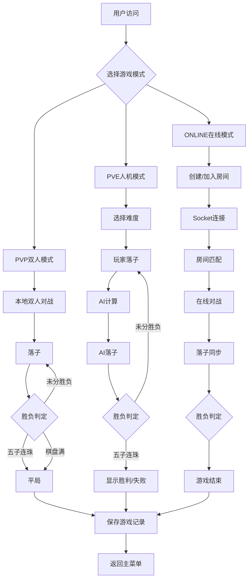
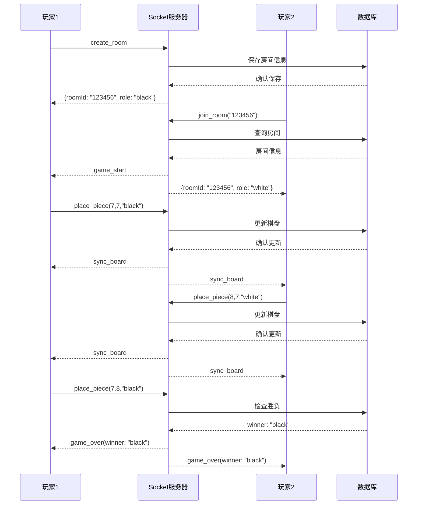
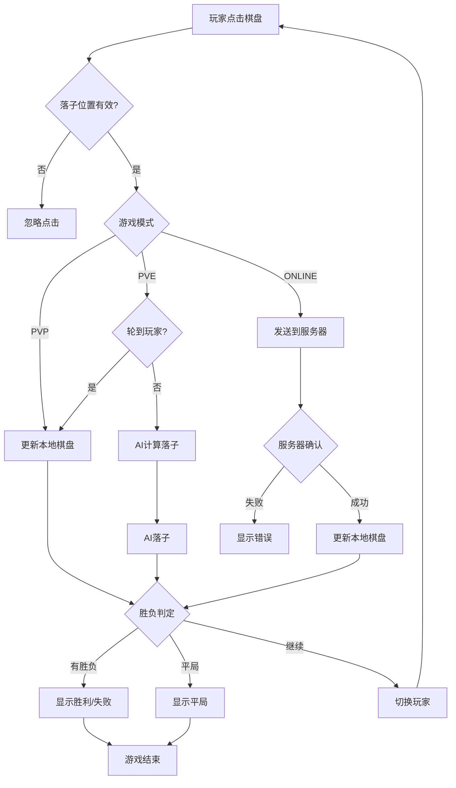
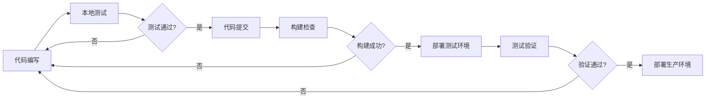

# 五子棋游戏项目完整技术文档

## 1. 项目总体结构分析

### 1.1 项目概述
本项目是一个功能完整的五子棋在线游戏，采用前后端分离架构，支持三种游戏模式：双人本地对战(PVP)、人机对战(PVE)和在线对战。项目使用 React + Vite 构建前端，Node.js + Express + Socket.io 构建后端服务，部署于腾讯云 CloudBase 平台。

项目地址：https://github.com/kinglionsz/wuziqi/tree/at_home 

五子棋游戏部署地址：https://codebuddy-9gu42kpn62ead2e2-1402693592.tcloudbaseapp.com/ 

### 1.2 技术栈
| 层级 | 技术选型 | 版本 |
|------|----------|------|
| 前端框架 | React | 19.2.0 |
| 构建工具 | Vite | 7.3.1 |
| 样式方案 | Tailwind CSS | 4.2.1 |
| 后端框架 | Express | 4.18.2 |
| 实时通信 | Socket.io | 4.7.2 |
| 云服务 | 腾讯云 CloudBase | - |
| 数据库 | Supabase + CloudBase NoSQL | - |

### 1.3 目录结构

```
wuziqi/
├── src/                          # 前端源代码
│   ├── App.jsx                   # 主应用组件
│   ├── App.css                   # 主应用样式
│   ├── main.jsx                  # 入口文件
│   ├── index.css                 # 全局样式
│   ├── components/               # React组件
│   │   ├── Board.jsx             # 棋盘组件
│   │   ├── Board.css             # 棋盘样式
│   │   ├── Footer.tsx            # 页脚组件
│   │   ├── Navbar.tsx            # 导航栏
│   │   └── Modals/               # 弹窗组件
│   │       ├── index.js          # 导出入口
│   │       ├── VictoryModal.jsx  # 胜利弹窗
│   │       ├── RulesModal.jsx    # 规则弹窗
│   │       ├── ReplayModal.jsx   # 回放弹窗
│   │       ├── SettingsModal.jsx # 设置弹窗
│   │       └── RoomModal.jsx     # 房间弹窗
│   └── assets/                   # 静态资源
│
├── cloudbase/                    # 云开发后端
│   ├── server/                    # 服务器代码
│   │   ├── server.js              # Socket.io服务器主文件
│   │   ├── index.js               # 云函数入口
│   │   ├── package.json           # 依赖配置
│   │   ├── Dockerfile              # Docker配置
│   │   └── utils/
│   │       ├── gameLogic.js       # 游戏逻辑
│   │       └── database.js        # 数据库工具
│   └── DEPLOY_GUIDE.md            # 部署指南
│
├── public/                       # 公共资源
├── dist/                        # 构建产物
├── package.json                  # 前端依赖配置
├── vite.config.js               # Vite配置
├── cloudbaserc.json             # CloudBase配置
├── deploy-all.bat               # 一键部署脚本
├── deploy-backend.bat           # 后端部署脚本
└── README.md                    # 项目说明
```

---

## 2. 代码功能深度解析

### 2.1 前端核心模块

#### 2.1.1 主应用组件 (App.jsx)
**文件路径**: `src/App.jsx`

**核心功能**:
- 游戏模式管理：支持PVP(双人)、PVE(人机)、ONLINE(在线)三种模式
- 状态管理：游戏设置、模态框控制、在线游戏状态
- Socket连接管理：WebSocket实时通信
- 游戏记录：本地存储和云端同步

**关键函数**:
- `useGameLogic()`: 本地游戏逻辑处理
- `useOnlineGame()`: 在线对战逻辑处理
- `handlePiecePlace()`: 处理落子事件
- `checkWinner()`: 胜负判定

#### 2.1.2 棋盘组件 (Board.jsx)
**文件路径**: `src/components/Board.jsx`

**核心功能**:
- 15×15标准棋盘渲染
- 6种主题切换：default/wood/ocean/forest/night/pink
- 落子交互：鼠标悬停预览、点击落子
- 最后一步标记
- 棋子动画效果
- 5个星位点标识

**关键配置**:
```javascript
const THEMES = {
  default: { board: '#E3CDA6', black: '#000000', white: '#FFFFFF' },
  wood: { board: '#DEB887', black: '#2F1810', white: '#F5DEB3' },
  ocean: { board: '#87CEEB', black: '#1E3A5F', white: '#E0FFFF' },
  forest: { board: '#90EE90', black: '#228B22', white: '#F0FFF0' },
  night: { board: '#2C3E50', black: '#000000', white: '#ECF0F1' },
  pink: { board: '#FFB6C1', black: '#8B4557', white: '#FFF0F5' }
}
```

#### 2.1.3 弹窗组件系列
| 组件 | 功能 |
|------|------|
| SettingsModal | 游戏设置、难度选择、主题切换、音效设置 |
| RoomModal | 创建/加入房间、房间信息展示 |
| VictoryModal | 胜利提示、重新开始 |
| RulesModal | 游戏规则说明 |
| ReplayModal | 游戏回放控制 |

### 2.2 后端核心模块

#### 2.2.1 Socket.io服务器 (server.js)
**文件路径**: `cloudbase/server/server.js`

**核心事件处理**:
| 事件名 | 功能 | 参数 |
|--------|------|------|
| create_room | 创建游戏房间 | hostId |
| join_room | 加入游戏房间 | roomId, playerId |
| place_piece | 落子处理 | roomId, row, col, player |
| leave_room | 离开房间 | roomId, playerId |
| disconnect | 断开连接 | - |

**广播事件**:
| 事件名 | 接收方 | 数据 |
|--------|--------|------|
| game_start | 房间内所有玩家 | {roomId, players} |
| sync_board | 房间内所有玩家 | {board, currentPlayer} |
| game_over | 房间内所有玩家 | {winner, board} |
| opponent_disconnected | 房间内所有玩家 | {playerId} |

#### 2.2.2 游戏逻辑 (gameLogic.js)
**文件路径**: `cloudbase/server/utils/gameLogic.js`

**核心算法**:

1. **胜负判定** - 四方向检测五子连珠
```javascript
checkWinner(board, row, col, player)
// 检测水平、垂直、主对角线、副对角线四个方向
// 任意方向形成五子连珠即判定胜利
```

2. **平局判定**
```javascript
checkDraw(board)
// 棋盘225个位置全部落子且无胜负
```

3. **落子验证**
```javascript
validateMove(row, col, board)
// 检查位置是否在棋盘范围内
// 检查位置是否已有棋子
```

4. **房间创建**
```javascript
createRoom(roomId, hostId)
// 生成6位随机房间号
// 初始化房间状态
```

#### 2.2.3 数据库工具 (database.js)
**文件路径**: `cloudbase/server/utils/database.js`

**功能**:
- 使用 CloudBase NoSQL 存储房间数据
- 支持数据库初始化、查询、保存、删除
- 后台异步保存（fire-and-forget模式）
- 完善的错误处理和日志输出

**集合名称**: `wuziqi_rooms`

---

## 3. 模块化任务分解

### 3.1 前端模块
| 模块 | 职责 | 依赖 |
|------|------|------|
| App主模块 | 状态管理、路由控制、Socket连接 | Board, Modals |
| Board棋盘模块 | 棋盘渲染、落子交互 | GameLogic |
| Modal弹窗模块 | UI交互、数据展示 | App State |
| Settings设置模块 | 配置管理、持久化 | localStorage |
| Online在线模块 | WebSocket通信 | Socket.io |

### 3.2 后端模块
| 模块 | 职责 | 依赖 |
|------|------|------|
| Server主模块 | Socket连接管理、事件处理 | Express, Socket.io |
| GameLogic游戏逻辑 | 胜负判定、落子验证 | - |
| Database数据库 | 数据持久化 | CloudBase SDK |

---

## 4. 整体业务流程图



---

## 5. 各功能模块专用流程图

### 5.1 在线对战流程图



### 5.2 落子处理流程



---

## 6. 数据库设计文档

### 6.1 Supabase表结构

#### 6.1.1 game_records (游戏记录表)
| 字段名 | 类型 | 说明 |
|--------|------|------|
| id | uuid | 主键，自增 |
| created_at | timestamp | 创建时间 |
| game_mode | varchar(20) | 游戏模式(PVP/PVE/ONLINE) |
| winner | varchar(10) | 获胜方(black/white/ai/draw) |
| moves | jsonb | 落子记录数组 |
| pve_difficulty | varchar(10) | PVE难度(easy/medium/hard) |
| duration | integer | 游戏时长(秒) |

#### 6.1.2 game_rooms (游戏房间表)
| 字段名 | 类型 | 说明 |
|--------|------|------|
| room_id | varchar(10) | 房间号(主键) |
| created_at | timestamp | 创建时间 |
| host_id | varchar(50) | 房主ID |
| guest_id | varchar(50) | 玩家2 ID |
| status | varchar(20) | 状态(waiting/playing/finished) |
| board_state | jsonb | 棋盘状态 |
| current_player | varchar(10) | 当前玩家 |

### 6.2 CloudBase NoSQL集合

#### 6.2.1 wuziqi_rooms (在线房间集合)
```json
{
  "_id": "ObjectId",
  "roomId": "123456",
  "hostId": "socket_id_1",
  "guestId": "socket_id_2",
  "board": [[0,0,...],...],
  "currentPlayer": "black",
  "gameStatus": "playing",
  "createdAt": "2024-01-01T00:00:00Z"
}
```

---

## 7. 云服务器部署指南

### 7.1 环境配置要求

| 环境 | 要求 |
|------|------|
| Node.js | >= 18.0.0 |
| npm | >= 9.0.0 |
| Docker | >= 20.10.0 |
| 云开发CLI | 最新版本 |

### 7.2 依赖安装步骤

```bash
# 1. 安装前端依赖
npm install

# 2. 安装后端依赖
cd cloudbase/server
npm install
```

### 7.3 服务启动方式

#### 开发环境
```bash
# 启动前后端一体化
npm run start

# 分别启动
npm run dev          # 前端
cd cloudbase/server && node server.js  # 后端
```

#### 生产环境部署
```bash
# 一键部署(前端+后端)
deploy-all.bat

# 单独部署后端
deploy-backend.bat
```

### 7.4 配置参数说明

#### 前端环境变量 (.env)
| 变量名 | 说明 | 默认值 |
|--------|------|--------|
| VITE_SOCKET_URL | Socket服务器地址 | http://localhost:3000 |
| VITE_SUPABASE_URL | Supabase项目URL | - |
| VITE_SUPABASE_KEY | Supabase API密钥 | - |

#### 后端环境变量
| 变量名 | 说明 | 默认值 |
|--------|------|--------|
| PORT | 服务端口 | 3000 |
| ALLOWED_ORIGIN | 允许的跨域来源 | * |
| NODE_ENV | 运行环境 | production |
| FORCE_DISABLE_DB | 禁用数据库 | 0 |

### 7.5 部署信息

| 项目 | 值 |
|------|-----|
| 环境ID | codebuddy-9gu42kpn62ead2e2 |
| 云托管服务名 | wuziqi-server |
| 前端访问地址 | codebuddy-9gu42kpn62ead2e2-1402693592.tcloudbaseapp.com |
| 后端访问地址 | wuziqi-server-227261-9-1402693592.sh.run.tcloudbase.com |
| 容器端口 | 3000 |
| 部署方式 | 容器型云托管 |

---

## 8. 开发与部署完整工作流程

### 8.1 本地开发流程



### 8.2 版本发布流程

1. **开发完成** → 本地测试通过
2. **代码审查** → 确保代码质量
3. **构建产物** → `npm run build`
4. **部署后端** → `deploy-backend.bat`
5. **部署前端** → `tcb hosting deploy`
6. **线上验证** → 访问测试
7. **版本标记** → Git tag

### 8.3 常见问题排查

| 问题 | 可能原因 | 解决方案 |
|------|----------|----------|
| WebSocket连接失败 | 服务器未启动/地址错误 | 检查VITE_SOCKET_URL配置 |
| 房间创建失败 | 数据库连接问题 | 检查FORCE_DISABLE_DB设置 |
| 落子无效 | 位置已被占用 | 等待对手落子 |
| 部署失败 | Docker镜像问题 | 检查cloudbaserc.json配置 |

---

## 附录：版本信息

- **项目版本**: v1.2.1
- **文档版本**: 1.0.0
- **最后更新**: 2026-03-01
